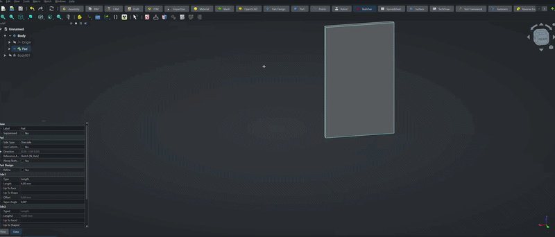
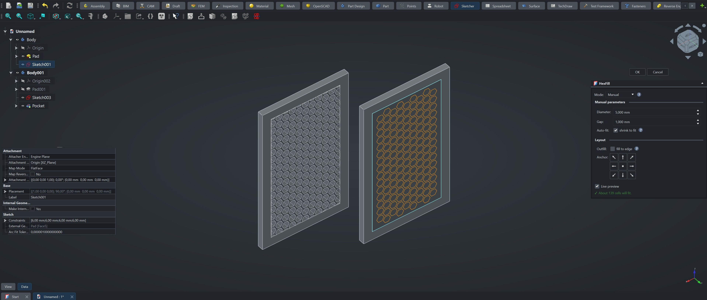

# HexFill

**Fill any sketch with a honeycomb pattern in one click.**

Drawing a honeycomb by hand in FreeCAD is slow and tedious. HexFill does it for
you: pick a sketch, choose how big the cells should be, and it builds the whole
hexagonal grid for you. The result is an ordinary sketch — so you can **Pocket**
it to make a perforated panel, or **Pad** it into a honeycomb solid.

 

## What you can do with it

- Lightweight panels and grilles (pocket the honeycomb through a plate)
- Honeycomb infill for 3D-printed or machined parts
- Decorative hex patterns on any flat face

## How to use it

1. Make a sketch with a closed outline (rectangle, circle, any shape) and Pad it.
2. Select that sketch in the model tree.
3. Click **HexFill** (in the Sketcher toolbar or the *Tools* menu).
4. Adjust the cell size in the side panel — you see a live preview as you type.
5. Press **OK**. A new `HexGrid` sketch appears.
6. Select `HexGrid` and use **Pocket** (cut the holes) or **Pad** (raise the walls).

## Options

| Option | What it does |
|--------|--------------|
| **Mode: Manual** | You set the cell diameter and the wall thickness (gap). |
| **Mode: Auto** | Picks a strong, light honeycomb automatically from the sketch size. |
| **Outfill** | Trims the edge cells to the outline so the pattern fills right to the border. |
| **Anchor (3×3)** | Chooses where the grid starts — centered, from a corner, etc. |
| **Live preview** | Shows the grid in the 3D view while you tune the numbers. |

## Installation

**Addon Manager** (recommended): `Tools → Addon manager`, find **HexFill**, click *Install*, restart FreeCAD.

**Manual:** copy this folder into your FreeCAD `Mod` directory and restart:

| OS | Path |
|----|------|
| Windows | `%APPDATA%\FreeCAD\Mod\` |
| Linux | `~/.local/share/FreeCAD/Mod/` |
| macOS | `~/Library/Application Support/FreeCAD/Mod/` |

## Requirements

FreeCAD 0.21 or newer.

## License

MIT — see [LICENSE](LICENSE).
